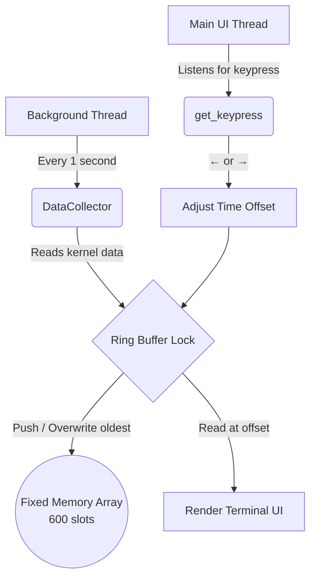

# 🕹️ Retromon

### The system monitor that lets you look into the past (Example - Task manager in Windows).

Most monitoring tools tell you what's happening **right now**.  
Retromon tells you what happened **back then** — without any logging, without any setup, without any performance cost.

---

## Why Does This Exist?

You're working. Your computer freezes for 3 seconds. By the time you alt-tab to check, everything looks normal.

What just happened? You'll never know — unless you were already recording.

**Retromon runs silently in your terminal and records everything.** Press `←` and travel back in time to see exactly which process spiked your CPU, exactly when it happened.

---

## Features

- ⏪ **Rewind up to 10 minutes** of system history instantly
- 📊 **Tracks CPU, RAM, and top 20 processes** updated every second
- 🔒 **O(1) memory usage** — uses the same RAM at hour 10 as it does at second 1
- 🧵 **Non-blocking UI** — background thread collects data while you navigate history
- 💻 **Truly cross-platform** — runs identically on Windows, Linux, and macOS
- ⚡ **Zero dependencies** beyond one lightweight library (`psutil`)
- 🖥️ **Pure terminal** — no Electron, no GUI framework, no browser

---

## Quick Start

```bash
git clone https://github.com/Arman-Khan-24/Retromon.git
cd Retromon
pip install psutil
python app.py
```

> Windows users: double-click `run.bat`

---

## Controls

| Key | Action |
|---|---|
| `←` Left Arrow | Go back 1 second |
| `→` Right Arrow | Go forward 1 second |
| `Space` | Jump to live view |
| `Q` | Quit |

---

## How It Works

Retromon is built on four components working together:



### DataCollector
Interfaces with your OS kernel via `psutil`. Every tick, it reads global CPU %, global RAM usage, and iterates all active PIDs — tracking CPU deltas and packaging the top 20 processes into a `SystemSnapshot`.

### Ring Buffer
A fixed-size array of 600 slots pre-allocated at startup. When full, a pointer wraps to index `0` and silently overwrites the oldest entry. This is why Retromon's memory footprint never grows — it operates in true **O(1) space**.

### Concurrency Engine
A background `daemon` thread runs the collector on a 1Hz timer, completely independent of the UI. A `threading.Lock()` mutex ensures that if you press an arrow key at the exact microsecond a new snapshot is being written, neither the read nor the write corrupts the other.

### Terminal UI
Zero-flicker rendering via ANSI cursor reset (`\033[H`) — new values are painted directly over old characters without clearing the screen. Arrow key interception is handled natively: `msvcrt` on Windows, `termios` + `select` on Linux/macOS, translating raw hex/ANSI bytes into logical navigation commands.

---

## Requirements

- Python 3.6+
- psutil (`pip install psutil`)
- Works on Windows, Linux, macOS

---

## Who Is This For?

- **Developers** debugging intermittent performance issues
- **Students** learning OS concepts like ring buffers, threading, and mutex locks in a real working project
- **Power users** who want more than Task Manager gives them

---

## Contributing

Pull requests are welcome. If you find a bug or want to add a feature (export to CSV, configurable buffer size, per-core CPU tracking), open an issue first to discuss.

---

## License

MIT — free to use, fork, and build on.

---

*Built because Task Manager only shows you the present. Sometimes you need the past.*
